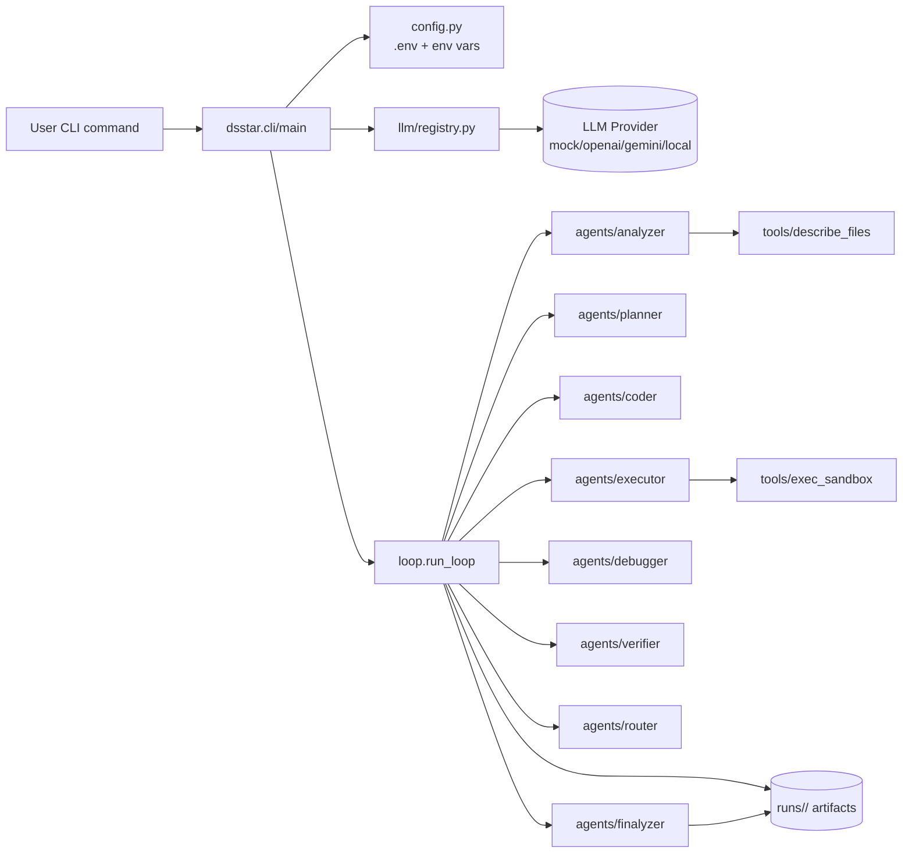
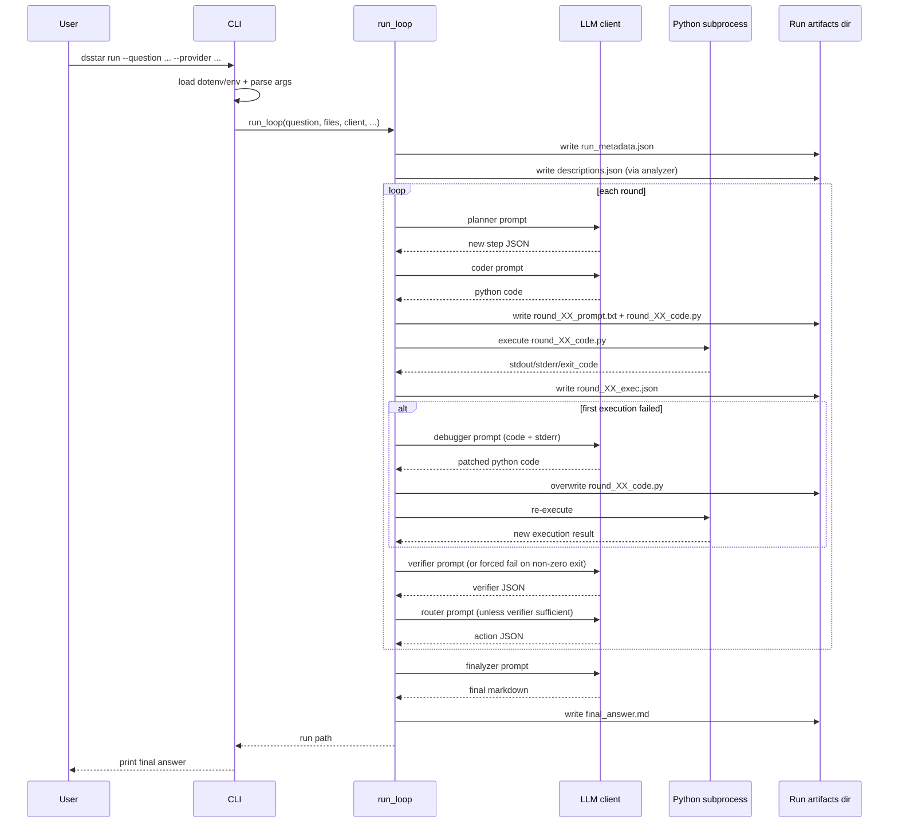

# Architecture Overview

This repository implements a **single-process Python orchestration loop** for a DS-STAR-style iterative coding agent. The system is not an Electron/React stack; instead, it is a CLI-driven Python package that coordinates role-oriented modules (analyzer, planner, coder, executor, debugger, verifier, router, finalyzer), a pluggable LLM client layer, and file-based run artifacts.

At runtime, `dsstar.cli:main` parses the `run` command, loads environment variables (and optionally `.env`), then selects an LLM provider (`mock`, `openai`, `gemini`, `local`). `run_loop` creates a timestamped run folder and iteratively executes:

1. **Analyze** user-provided input files.
2. **Plan** one todo step.
3. **Code** a full Python script for the next step.
4. **Execute** script in subprocess sandbox with timeout.
5. **Debug** and re-execute if the first execution fails.
6. **Verify** sufficiency (with hard guard that failed execution cannot be “sufficient”).
7. **Route** next action (add/backtrack/stop) and continue.
8. **Finalize** answer markdown.

All persisted state is file-based in `runs/<timestamp>/`. There is no database dependency in the codebase.

## Component diagram

## Sequence diagram (core workflow: one run with potential retry)

## Critical invariants (must not break)

1. **Run artifact contract**
   - `run_loop` and tests assume timestamped run directory plus files like `round_00_code.py`, `round_00_exec.json`, and `final_answer.md`.
2. **Role-tag prompt protocol**
   - Mock/test clients branch on `ROLE: ...` markers (`PLANNER`, `CODER`, etc.); changing role headers without coordinated updates will break behavior/tests.
3. **Verifier failure guard**
   - If `exit_code != 0`, verifier must return insufficient/fix_step without calling the LLM; this prevents false success states.
4. **Router safety behavior**
   - `next_action == fix_step` must not be converted into stop; control flow forces additional work.
5. **Provider fallback semantics**
   - Missing `OPENAI_API_KEY` or `GEMINI_API_KEY` must fall back to `mock` with warning, keeping CLI runnable in low-config environments.
6. **Execution cwd semantics**
   - Generated scripts execute with cwd set to run directory, so relative writes (e.g., `hello.txt`) land in that run folder.
7. **Optional dependency behavior**
   - `.env` loading only occurs when `python-dotenv` is installed; `.xlsx` introspection only occurs when `openpyxl` is installed.
